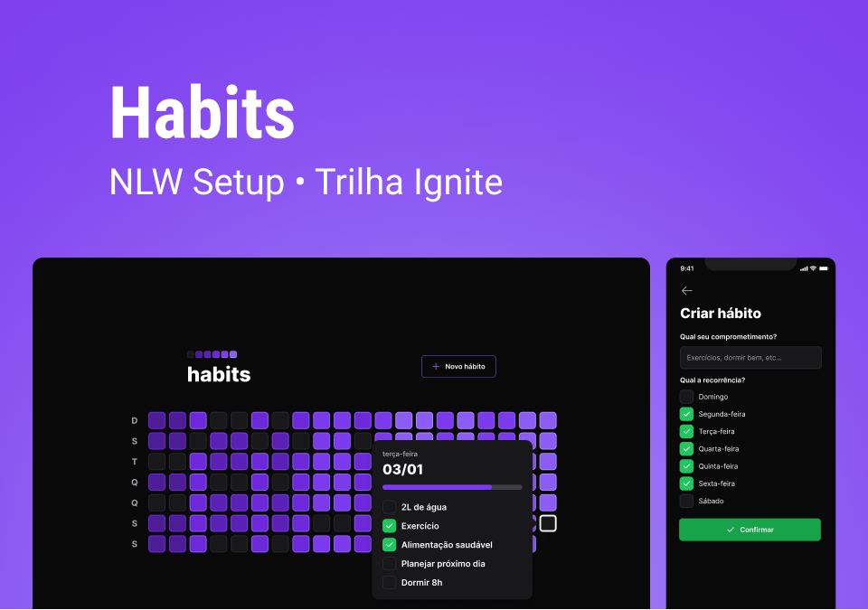

<h1 align="center">NLW Setup</h1>

<p align="center">
  
</p>

<p align="center">
    </img>
</p>


<br>

## 💻 Projeto

O <b>NLW Setup</b> e um projeto multiplataforma que disponibiliza meios para montar cronograma e controlar o dia-a-dia através de um calendário interativo, foi desenvolvido durante a semana do [NLW-Setup](https://github.com/rocketseat-education/nlw-setup-ignite) com base neste [protótipo](https://www.figma.com/file/s5mUuUfzxN1N4AltxGfJzO/NLW---Habits?type=design&t=xgj4nI3Va3DXzjF9-1).


<br>

## ✨ Tecnologias

Este projeto foi desenvolvido com as seguintes tecnologias:

> [Server](./server/)
- [NodeJS](https://nodejs.org/en/)
- [TypeScript](https://www.typescriptlang.org/)
- [Fastify](https://www.fastify.io/)
- [Prisma](https://www.prisma.io/)
- [Mermaid](https://github.com/mermaid-js/mermaid)
- [Zod](https://github.com/colinhacks/zod)
- [DayJs](https://day.js.org/)
  
> [Web](./web)
- [React](https://reactjs.org/)
- [radix](https://www.radix-ui.com/)
- [Axios](https://axios-http.com/)
- [DayJs](https://day.js.org/)
- [TypeScript](https://www.typescriptlang.org/)
- [Tailwindcss](https://tailwindcss.com/)
  
> [Mobile](./mobile)
- [Expo](https://docs.expo.dev/)
- [Axios](https://axios-http.com/)
- [DayJs](https://day.js.org/)
- [Nativewind](https://www.nativewind.dev/)
- [React Native](https://reactnative.dev/)
- [Navigation](https://reactnavigation.org/)
- [TypeScript](https://www.typescriptlang.org/)

<br>

## 🚀 Como executar

#### **❗ Acesse os repositórios para mais detalhes**
- Clone o repositório
> [Server](./server/)
- Execute `cd server` para ir até a pasta da api
- Execute `npm install` para instalar as dependências
- Execute o `npm run dev` para iniciar a aplicação na porta <b>3333</b>
- Por fim, a <b>API</b> estará disponível em `http://localhost:3333`
  
> [Web](./web)
- Execute `cd web` para ir até a pasta da Web Page
- Execute `npm install` para instalar as dependências
- Execute o [Server](./server#-como-executar) e conecte-se
- Execute o `npm run dev` para iniciar a aplicação na porta <b>3000</b>
- Por fim, o <b>Website</b> estará disponível em `http://localhost:3000`

> [Mobile](./mobile)
#### **Obs: Tenha o expo-cli instalado na sua maquina**

- Execute `cd mobile` para ir até a pasta mobile
- Execute `npx expo install` para instalar as dependências
- Execute o [Server](./server#-como-executar) e conecte-se
- Execute o `npx expo start` para iniciar a aplicação
- Por fim, o **Bundler do APP** estará disponível

<br>

## 📄 Licença

Esse projeto está sob a licença MIT. Veja o arquivo [LICENSE](LICENSE) para mais detalhes.

<br/>

## 🚧 Atenção
O código em [server.ts](./server/src/server.ts#L34) deve estar assim para funcionar a comunicação com o [Mobile](./mobile)
```ts
await fastify.listen({port: port, host: "0.0.0.0"})
```

> ##### **Obs: O arquivo [ERD.svg](./server/prisma/ERD.svg) e um Diagrama de Entidade e Relacionamento do Banco de Dados que é gerado automaticamente toda vez que ocorre uma migrate no prisma**